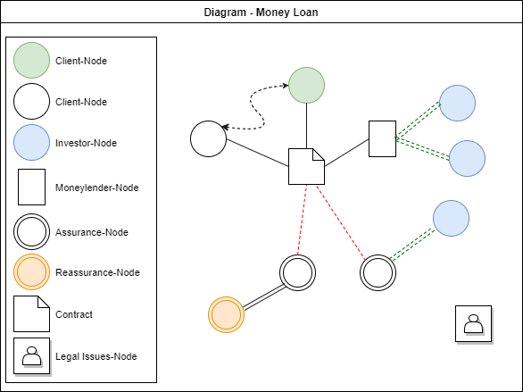
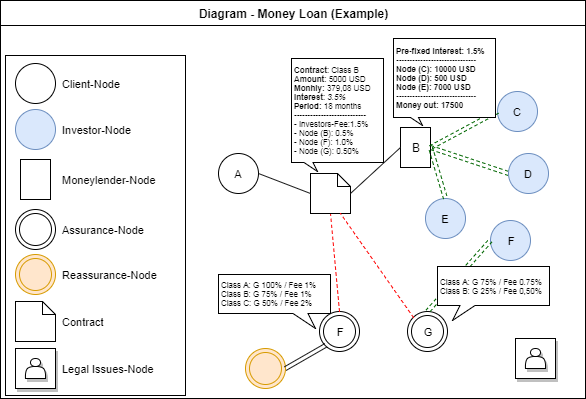
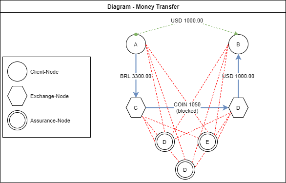

# Decentralized Banking System

## TL;DR;

* Decentralized banking system, think of it as a free and decentralized market; or such as an UBER for loans(but without an Uber Co.).

* Regarding money loans, isolated agents can act as investors, lenders, assurance, reassurance and legal partners.

* Regarding money transfer, isolated agents can act as exchanges and assurance nodes. Exchanges receive and transfer fiduciary money to clients, among them tokens are exchanged.

# Whitepaper (draft)

The goal is to create a decentralized money transfer and lending system, which allows the free market to establish the price of the fees and the interest.

The control is performed in a decentralized manner using a smart-contract to record the transactions and the IPFS network to store the data.

# Money Loan

The decentralized money loan allows Investor-Nodes to invest in Moneylender-Nodes. Moneylender-nodes can then only use the funds to lend money to interested nodes(Client-Nodes). Another part of a transaction are the Assurance-Nodes, which guarantee the payment to the Investors-Nodes, in case of default. They also help to classify and define a loan contract regarding its risk.

In a decentralized loan network, the guarantee of the operation is given by the separation of function between the nodes. There should be no limitation on how the operations are formed, not having to have Assurance- and/or Reassurance-Nodes.

## Types of Nodes

* **Client-Node**: User who wants to get a loan.

* **Agent-Node**: The agents are responsible for intermediating the loans to the client.

* **Investor-Node**: User who wants to invest the money. 

* **Moneylender-Node**: User that holds the funds of the Investor-Nodes. Responsible for managing the loans. Responsible for defining contract risk together with the Assurance-Node.

* **Assurance-Node**: User that holds the funds of the Investor-Nodes. Responsible for the guarantee of the contract. Responsible for defining contract risk together with the Moneylender-Node.

* **Reassurance-Node**: User that holds the funds of the Investor-Nodes. Responsible for the guarantee of an Assurance-Node.

* **Legal Issues-Node**: User responsible to deal with legal issues arising from contracts. It can be subcontracted by an Assurance- or Reassurance-Node.

## About the Money Lend Market

The whole market is based on the established trust between the nodes, thus considering that a fair market is formed naturally when the interest of the approving-nodes is to form a fair market. For the maintenance of a fair market, the law of the free market applies, where a node that does not act in accordance with the market is naturally eliminated.

In this market Investor-Nodes may receive the biggest slice of the cake, after all they have the money. Meneylender-Nodes can be viewed as mutual funds, which will work investors money in order to deliver the best rate, or at least the agreed rate. They can compete with lower rates and more attractive gains. Trust and profitability will attract more investors.

Investors may also allocate funds in Assurance-Nodes, which are responsible for ensuring payment to investors in case of default. Assurance-Nodes will have a rate dictated by the market, the lower the number of default, the lower the rate and vice versa. They can also maximize earnings and dilute risk.

Another way to capitalize is with the success of the market. The higher the confidence it generates, the more money it makes through interest, the greater the Token value. For example: If you consider that, at the beginning, 100 TOKENS are equal at 100 USD, when 2% interest acts along this 100 USD, making it 102 USD. You may consider that the 100 TOKENS now have more value, so now they represent 102 USD.

Although it is important to mention that the above mechanism has an implicit lock that makes it intentionally less interesting for the purely speculative market. As the highest value is generated from the interest arising from the loans, if the speculative market increases the value of tokes, the reference value is the fiduciary currency for which the loan was made. If the fiduciary currency buys a smaller number of tokens than expected on the contract, new tokens are generated and made available to investors - for the contract in question -. Speculators will see only more tokens being injected, naturally increasing the supply of tokens. However, this does not limit the speculative market to act, only works as a barrier, slowing it down.

## Investors Money

In order to invest money, Investor-Nodes will have to acquire TOKENS from the market and transfer this tokens to a Moneylender-Node.

## The operation

The loan operation consists of transferring funds from a Moneylender-Node to a Client-Node. For a lending operation, a fiduciary currency is determined, which the loan takes as a reference, allowing for oscillations in the token price not to affect the agreed rates.

For the operation itself, Client-Node and Moneylender-Node agree on the terms of the contract. The transfer is given only upon approval of the Moneylender-Node and Assurance-Nodes (when determined). After approval of the loan, the funds are transferred to the client's wallet.

Monthly loan repayments must be made by the client in the given period. The agreed installment amount must be converted into tokens and transferred to the Moneylender-Node accordingly.

When monthly loan repayments buy a smaller amount of tokens than expected, the system is responsible for creating new tokens and matching the number of tokens with the expected. This mechanism decelerates the speculative market by "forging more token".

When monthly loan repayments buy a greater amount of tokens than expected. The market slows the fall by selling more tokens, reducing the supply in the market.

## The Agent

	The transaction may have an intermediary, called an agent, which may be an institution that abstracts most of the complexity involved in the decentralized lending process.
The agent is responsible for carrying out the process, submitting the documents on behalf of the client, in addition to converting the tokens and delivering the money to the client. The monthly loan repayments are then made directly to the agent, being he the one responsible for interacting with the system.

## About Fraudulent Actions

If we consider a scam operation, where the Moneylender-Node, the Client-Node and the Assurance-Node are all the same person - that were able to somehow get approved by the network - with intention of gaining access to the investor's money. This scam operation will easily workout, although the only getting affected are the Investor-Nodes of the Assurance-Node. A way to prevent, or mitigate such risks it to trust only on investor nodes that accept half or less of their money from Investor-Nodes or by having Reassurance-Nodes as part of the Operations. Another option will be to trust on Moneylender-Nodes that use more than one Assurance-Node, considering that these actions make it difficult to execute a fraudulent action. 

## Client-Node A requests USD 5000 loan to Moneylender B with Assurance-Node

### Success Scenario

1. The user representing the Client-Node (A) selects a Moneylender-Node (B). As input the following parameters must be informed in order to create a Request.

    1. Amount of money taken on loan;

    2. Loan period;

    3. Predefined documents by the Moneylender. 

2. The Moneylender-Node performs a credit analysis. Contacts Client-node to request additional documents if necessary. The Moneylender compiles all the documentation in a dossier that is then forwarded to the Assurance-Nodes.

    4. The Moneylender- and the Assurance-Nodes must classify the contract-risk by voting on the request. During the voting process, the Assurance-Nodes may change their default interest. Once agreed, a contract is created and is available to the Moneylender-Node.

3. A proposal is formalized and sent to the customer by Moneylender. This proposal includes a valid period and the contract, that includes legal obligations, the amount of money, period, fees and interest.

4. The Client-Node accepts the proposal and signs the contract.

    5. After successful signature processing, an Oracle verifies the current value of the Token in the market, taking as reference the fiduciary currency chosen for the contract. The exact amount of tokens are transferred to the clients wallet.

## Operation Analysis

Considering the operation described in the above chapter, we can verify how the payments will occur in the agreed periods. For periods where market valuation is over, new tokens are created.

<table>
  <tr>
    <td>Month</td>
    <td>Monthly</td>
    <td>Variation</td>
    <td>Proportion</td>
    <td>Expected Tokens(flat market)</td>
    <td>Tokens Required</td>
    <td>Expected Tokens Price (currently)</td>
    <td>Tokens to Create</td>
  </tr>
  <tr>
    <td>1</td>
    <td>USD 379,08</td>
    <td>2,0%</td>
    <td>1,53</td>
    <td>568,62</td>
    <td>579,99</td>
    <td>USD 386,66</td>
    <td>11,37</td>
  </tr>
  <tr>
    <td>2</td>
    <td>USD 379,08</td>
    <td>0,5%</td>
    <td>1,51</td>
    <td>568,62</td>
    <td>571,46</td>
    <td>USD 380,98</td>
    <td>2,84</td>
  </tr>
  <tr>
    <td>3</td>
    <td>USD 379,08</td>
    <td>1,5%</td>
    <td>1,52</td>
    <td>568,62</td>
    <td>577,15</td>
    <td>USD 384,77</td>
    <td>8,53</td>
  </tr>
  <tr>
    <td>4</td>
    <td>USD 379,08</td>
    <td>1,1%</td>
    <td>1,52</td>
    <td>568,62</td>
    <td>574,87</td>
    <td>USD 383,25</td>
    <td>6,25</td>
  </tr>
  <tr>
    <td>5</td>
    <td>USD 379,08</td>
    <td>1,5%</td>
    <td>1,52</td>
    <td>568,62</td>
    <td>577,15</td>
    <td>USD 384,77</td>
    <td>8,53</td>
  </tr>
  <tr>
    <td>6</td>
    <td>USD 379,08</td>
    <td>0,8%</td>
    <td>1,51</td>
    <td>568,62</td>
    <td>573,17</td>
    <td>USD 382,11</td>
    <td>4,55</td>
  </tr>
  <tr>
    <td>7</td>
    <td>USD 379,08</td>
    <td>0,2%</td>
    <td>1,50</td>
    <td>568,62</td>
    <td>569,76</td>
    <td>USD 379,84</td>
    <td>1,14</td>
  </tr>
  <tr>
    <td>8</td>
    <td>USD 379,08</td>
    <td>-0,5%</td>
    <td>1,49</td>
    <td>568,62</td>
    <td>565,78</td>
    <td>USD 377,18</td>
    <td>0,00</td>
  </tr>
  <tr>
    <td>9</td>
    <td>USD 379,08</td>
    <td>-1,0%</td>
    <td>1,49</td>
    <td>568,62</td>
    <td>562,93</td>
    <td>USD 375,29</td>
    <td>0,00</td>
  </tr>
  <tr>
    <td>10</td>
    <td>USD 379,08</td>
    <td>-0,7%</td>
    <td>1,49</td>
    <td>568,62</td>
    <td>564,64</td>
    <td>USD 376,43</td>
    <td>0,00</td>
  </tr>
  <tr>
    <td>11</td>
    <td>USD 379,08</td>
    <td>0,9%</td>
    <td>1,51</td>
    <td>568,62</td>
    <td>573,74</td>
    <td>USD 382,49</td>
    <td>5,12</td>
  </tr>
  <tr>
    <td>12</td>
    <td>USD 379,08</td>
    <td>2,1%</td>
    <td>1,53</td>
    <td>568,62</td>
    <td>580,56</td>
    <td>USD 387,04</td>
    <td>11,94</td>
  </tr>
  <tr>
    <td>13</td>
    <td>USD 379,08</td>
    <td>1,6%</td>
    <td>1,52</td>
    <td>568,62</td>
    <td>577,72</td>
    <td>USD 385,15</td>
    <td>9,10</td>
  </tr>
  <tr>
    <td>14</td>
    <td>USD 379,08</td>
    <td>2,0%</td>
    <td>1,53</td>
    <td>568,62</td>
    <td>579,99</td>
    <td>USD 386,66</td>
    <td>11,37</td>
  </tr>
  <tr>
    <td>15</td>
    <td>USD 379,08</td>
    <td>2,1%</td>
    <td>1,53</td>
    <td>568,62</td>
    <td>580,56</td>
    <td>USD 387,04</td>
    <td>11,94</td>
  </tr>
  <tr>
    <td>16</td>
    <td>USD 379,08</td>
    <td>1,7%</td>
    <td>1,53</td>
    <td>568,62</td>
    <td>578,29</td>
    <td>USD 385,52</td>
    <td>9,67</td>
  </tr>
  <tr>
    <td>17</td>
    <td>USD 379,08</td>
    <td>0,9%</td>
    <td>1,51</td>
    <td>568,62</td>
    <td>573,74</td>
    <td>USD 382,49</td>
    <td>5,12</td>
  </tr>
  <tr>
    <td>18</td>
    <td>USD 379,08</td>
    <td>-1,0%</td>
    <td>1,49</td>
    <td>568,62</td>
    <td>562,93</td>
    <td>USD 375,29</td>
    <td>0,00</td>
  </tr>
  <tr>
    <td>Total</td>
    <td>USD 6.823,44</td>
    <td></td>
    <td></td>
    <td>10235,16</td>
    <td>10324,43</td>
    <td>USD 6.882,96</td>
    <td>107,47</td>
  </tr>
</table>

# Money Transfer

The decentralized money transfer allows the free market to set the price of the fees and remunerate the participating nodes for carrying out the transaction.

## Types of Nodes

* **Client-Node**: User who wants to perform or receive a transfer.

* **Exchange-Node**: User that receives the money from the sender-user and transfers it to a secondary Exchanger-node. Exchange-Nodes can define their own fees.

* **Assurance-Node**: User that in a money-exchange transaction, plays the role of a third-person, responsible for mediating the transaction. The user is responsible for checking the artifacts involved in the transaction. In case of dispute, the user is responsible for determining and deciding alone (or jointly when more Assurance-nodes are involved) the destination of the funds(Coins) kept as collateral. The dispute is finally decided by voting with whom the funds in guarantee remain. Another assignment of this user is the homologation of new Exchange-Nodes, where documents must be verified. Assurance-Nodes have a predefined and immutable fee.

## Noda (A) transfers money to Node (B)

### Success Scenario

1. The user representing Node (A) defines the transaction path

    1. The source Exchange-Node is defined;

    2. The destination Exchange-Node is defined;

    3. An odd number of Assurance-Nodes is defined;

2. The user representing Node (A) starts a transaction by informing the amount of money he wants to send.

    4. The system randomly selects the Assurance-Nodes for this transaction;

    5. The system sets the transaction to "Pending Exchange-Nodes", where both of the selected nodes have to accept the transaction.

3. The user representing the Exchange-Node (D) accepts the transaction;

4. The user representing the Exchange-Node (C) accepts the transaction by defining the target currency quote of this transaction and its timeout; and confirms how the money transfer between Node (A) and Node (C) should occur.

    6. The system calculates the amount of money to be transferred from Node (A) including the fees from both Exchange-Nodes and Assurance-Nodes;

    7. The system blocks the same amount of money represented in coins inside Node (C) wallet;

    8. The system sets the transaction to pending deposit.

5. The user representing the Node (A) performs the offline money transfer and submits the deposit slip, or any relevant artifact.

6. The user representing the Exchange-Node (C) confirms receiving the money.

    9. From the blocked coins, the amount in coins including the fee of the Exchange-Node(D) is transferred to Exchange-Node(D).

7. The user representing the Exchange-Node (D) performs the offline money transfer to Node (B) and submits the deposit slip, or any relevant artifact.

8. The user representing Node (B) confirms receiving the money.

    10. The system transfers the amount in fees to the Assurance-Nodes.

### Alternate Flow 1

3a. The user representing the Exchange-Node (D) rejects the transaction.

4a. The user representing Node (A) defines a new destination Exchange-Node;

5a. Rejoin at 2.2

### Alternate Flow 2

4a. The user representing the Exchange-Node (C) rejects the transaction before Exchange-Node(D) approves.

5a. Rejoin at 1;

### Alternate Flow 3

4a. The user representing the Exchange-Node (C) rejects the transaction after Exchange-Node(D) approves.

5a. The source Exchange-Node is redefined;

5a. Rejoin at 4;

### Alternate Flow 4

5a. The user representing the Node (A) does not perform the offline money transfer and does not confirm the transaction.

6a. After transaction timeout the Exchange-Node (C) is able to cancel the transaction. The blocked coins are released. No fee is paid to the Assurance-Node(s).

### Alternate Flow 5

5a. The user representing the Node (A) does not perform the offline money transfer and submits a fake deposit slip.

6a. The Exchange-Node (C) is not able to recognize the money transfer. If both nodes can not agree, anyone can initiate a mitigation process with the Assurance-Node(s). Both nodes must send all the relevant artifacts to the transaction.

7a. The Assurance-Node(s) must analyse the provided artifacts. If necessary new artifacts can be requested.

8a. Once each Assurance-Node did its analysis of the transaction, it will decide by voting, whether the coins are released - in case the money has not been deposited - or by transferring the blocked coins to Node (A). Each vote shall contain a description with the reason for the decision. Fees are paid to the Assurance-Node(s).

### Alternate Flow 6

6a. The user representing the Exchange-Node (C) denies having received the money.

7a. The Node (A) claims to have sent the money. If both nodes can not agree, anyone can initiate a mitigation process with the Assurance-Node(s). Both nodes must send all the relevant artifacts to the transaction.

7a. The Assurance-Node(s) must analyse the provided artifacts. If necessary new artifacts can be requested.

8a. Once each Assurance-Node did its analysis of the transaction, it will decide by voting, whether the coins are released - in case the money has not been deposited - or by transferring the blocked coins to Node (A). Each vote shall contain a description with the reason for the decision. Fees are paid to the Assurance-Node(s).

### Alternate Flow 7

6a. The user representing the Exchange-Node (C) does not confirm the transaction.

7a. After transaction timeout the Node (A) is able to cancel the transaction. The blocked coins are transferred to Node (A). No fee is paid to the Assurance-Node(s).

### Alternate Flow 8

6a. The user representing the Exchange-Node (D) does not performs the offline money transfer to Node (B) and does not confirm the transaction.

7a. After transaction timeout the Node (A) is able to replace Exchange-Node (D).

8a. The new Exchange-Node (D) needs to accept the ongoing transaction. 

9a. Rejoin at 7;

### Alternate Flow 9

6a. The user representing the Exchange-Node (D) does not performs the offline money transfer to Node (B) and does not confirm the transaction.

7a. After transaction timeout the Node (A) is able to cancel the transaction. Fees are paid except for Exchange-Node (D).

### Alternate Flow 10

6a. The user representing the Exchange-Node (D) does not performs the offline money transfer and submits a fake deposit slip.

7a. The Exchange-Node (D) is not able to recognize the money transfer. If both nodes can not agree, anyone can initiate a mitigation process with the Assurance-Node(s). Both nodes must send all the relevant artifacts to the transaction.

8a. The Assurance-Node(s) must analyse the provided artifacts. If necessary new artifacts can be requested.

8a. Once each Assurance-Node did its analysis of the transaction, it will decide by voting, whether the coins are released to Exchange-Node (D) - in case the money has been deposited - or by transferring the blocked coins to Node (B). Each vote shall contain a description with the reason for the decision. Fees are paid to the Assurance-Node(s).

### Alternate Flow 11

8a. The user representing the Node (B) denies having received the money.

9a. The Exchange-Node (D) claims to have sent the money. If both nodes can not agree, anyone can initiate a mitigation process with the Assurance-Node(s). Both nodes must send all the relevant artifacts to the transaction.

10a. The Assurance-Node(s) must analyse the provided artifacts. If necessary new artifacts can be requested.

11a. Once each Assurance-Node did its analysis of the transaction, it will decide by voting, whether the coins are released to the Exchange-Node (D) - in case the money has been deposited - or by transferring the blocked coins to Node (B). Each vote shall contain a description with the reason for the decision. Fees are paid to the Assurance-Node(s).

## Example 

Node (A) wants to transfer USD 1000.00 to Node (B), the money deposit will be made in Reals.

* Node (A) selects a source Exchange-Node that charges 0.5% for the transaction. The dollar spread is 2%.

* Node (A) selects a destination Exchange-Node that charges 0.5% for the transaction. The dollar spread is 2%.

* Node (A) define 1 as the number of Assurance-Nodes for this transaction. Each Assurance-Node charges 0,15%.

# Box of wishes

* Once the Exchange-Nodes have accumulated a lot of transaction, maybe the acceptance of a transaction can be defined as automatically. (money transfer)

* Companies as clients of this network may place their receivables as collateral for the loan. (money loan)

# Notes

* Agents can represent a new place in the market, creating a layer that abstracts the complexities involved in the blockchain.